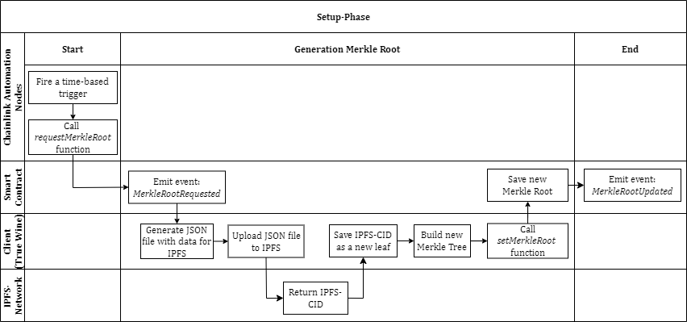

## Welcome to the OpenSource-Library of True Wine

This library allows you to verify the data integrity of the sensor data from a [True Wine](https://true.wine/) sensor unit. The sensor unit is located in True Wine's own wine cellar. The library is written in JavaScript.

#### Features
* Prototype implementation (production-ready to follow soon)
* Download the sensor data from [True Wine](https://true.wine/) via a defined interface
* Verification of data integrity according to a defined [protocol](#protocol) (see [Verification-Pphase](#verifikations-phase))
* Use of the blockchain technology [Polygon PoS](https://polygon.technology/polygon-pos) (test network: [Amoy](https://www.oklink.com/de/amoy))
* Use of the RPC provider [Alchemy](https://www.alchemy.com/)
* Use of the IPFS storage provider [NFT.Storage](https://nft.storage/)
* Use of the [OpenZeppelin Merkle Tree Library](https://www.npmjs.com/package/@openzeppelin/merkle-tree)
* Automation with [Chainlink Automation Nodes](https://docs.chain.link/chainlink-automation)
* Completely written in JavaScript
* **ISC licence** (without consideration of dependencies)

### Installing

#### NodeJS
```
npm install true-wine-os-lib
```

### Usage example
```
const osLib = require("true-wine-os-lib")

async function main() {
    const data = await osLib.dataFromWebsite()

    const result = await osLib.verifyIntegrity(data);

    if (result) {
        console.log("\n\n\u2713\u2713\u2713   Data Integrity could be verified.   \u2713\u2713\u2713\n\n")
    } else {
        console.log("\n\nXXX   Data Integrity could not be (fully) verified.   XXX\n\n")
    }
}

main()
```

## Background
[True Wine](https://true.wine/), a dynamically growing company, offers a trading platform for exquisite wines. Customers have the opportunity to purchase and offer wines. Until customers decide to consume the wines they have purchased, True Wine offers them the opportunity to store them under ideal conditions in the company's own wine cellar.

Storage conditions (e.g. temperature and humidity) are an important aspect of the trade in high-quality wines, as they influence the maturation process of the wines. Under the wrong conditions, the flavour of the wines is impaired and the wines may lose value. This makes it necessary to check the storage conditions.

To monitor the storage conditions, True Wine has developed a sensor unit that is located in the company's own wine cellar. This records the temperature and humidity and transfers the collected data to a True Wine application. The application stores the sensor data in a database in the cloud, processes it and displays it publicly on a website along with the wines.

Until now, it has not been possible to check whether True Wine itself, the cloud provider or potential external attackers manipulate the recorded temperature and humidity data after it has been collected and thus compromise its data integrity. The [protocol](#protocol) presented below is intended to remedy this situation.

## Protocol
The protocol is to be used in the fine wine industry by customers of the company [True Wine](https://true.wine/). With this protocoll customers are able to check the integrity of the storage conditions (temperature and humidity) presented to them for their wines using the protocol. Any manipulation of the data by [True Wine](https://true.wine/), the Cloud-Provider or external attackers will be detected by the protocol.

In order to provide a reliable solution for verifying data integrity, blockchain technology [Polygon](https://polygon.technology/polygon-pos) is used in the protocol, as it is decentralised, transparent, cannot be manipulated and is secure. Signed sensor data is represented by a [Merkle Tree](https://en.wikipedia.org/wiki/Merkle_tree) and its root is written to a [smart contract](#smart-contract) on Polygon. Customers can use [the open source library](https://www.npmjs.com/package/true-wine-os-lib) from this repository to detect possible data integrity losses. Using an open source library makes the protocol (especially the [Verification-Phase](#verification-phase)) transparent and the result of the verification trustworthy for you.

The protocol consists of an [Initialisation-Phase](#initialisation-phase), a [Setup-Phase](#setup-phase) and a [Verification-Phase](#verification-phase). The individual phases are briefly described below. In summary, it can be said that the implementation of these phases enables the blockchain-based verification of the data integrity of the sensor data of [True Wine](https://true.wine/) for you as a customer.

### Initialisation-Phase
The Initialisation-Phase is carried out once before the first [Setup-Phase](#setup-phase). Here, among other things, the [smart-contract](#smart-contract) is deployed on the [Polygon PoS](https://polygon.technology/polygon-pos) test network [Amoy](https://www.oklink.com/de/amoy). The address of the [smart contract](#smart-contract) can be found in the [.env](https://github.com/tlauer5/os-lib-true-wine-masterthesis/blob/main/.env).

### Setup-Phase
In the Setup-Phase, the necessary steps are carried out to ensure the verifiability of the data integrity for the subsequent [Verification-Phase](#verification-phase). The Setup-Phase is the prerequisite for the [Verification-Phase](#verification-phase). The Setup-Phase is started at regular intervals by [Chainlink Automation Nodes](https://docs.chain.link/chainlink-automation). The following diagram illustrates the Setup-Phase. The function and event names in the diagram refer to the [smart contract](#smart-contract).



In the Setup-Phase, the Chainlink Automation Nodes call the *requestMerkleRoot* function in the Polygon [smart contract](#smart-contract). This function emits the event *MerkleRootRequested*. After registering the event in the application, [True Wine](https://true.wine/) (client) saves the sensor data of a time interval in a JSON file, uploads it to [IPFS](https://ipfs.tech/) and receives an [IPFS CID](https://docs.ipfs.tech/concepts/content-addressing/) for it. The [IPFS CID](https://docs.ipfs.tech/concepts/content-addressing/) is the new leaf in a [Merkle Tree](https://en.wikipedia.org/wiki/Merkle_tree), the root of which the client writes to the [smart contract](#smart-contract) at the end of the Setup-Phase using the *setMerkleRoot* function. This function emits the event *MerkleRootUpdated*.

### Verification-Phase
In the Verification-Phase, the integrity of the data processed in the [Setup-Phase](#setup-phase) is checked. You initiate the process using this library to detect possible losses of data integrity (see [here](#usage-example)). The following figure illustrates the Verification-Phase implemented by the code of this library.


During the Verification-Phase, the user (you) starts the data integrity check on their local computer via this library (see [here](#usage-example)). The library carries out checks and data comparisons with the data stored in the [smart contract](#smart-contract). At the end of the checks, the library informs the user (you) whether the data has integrity or not.

## Smart Contract
The smart contract is written in the [Solidity](https://soliditylang.org/) programming language and deployed in the [Polygon PoS](https://polygon.technology/polygon-pos) test network [Amoy](https://www.oklink.com/de/amoy). The current address of the contract can be found in the [.env](https://github.com/tlauer5/os-lib-true-wine-masterthesis/blob/main/.env). The [ABI of this contract](https://github.com/tlauer5/os-lib-true-wine-masterthesis/blob/main/rpc_wrapper/abi/abi.json) is also stored in the library in order to read data from the contract via the RPC provider [Alchemy](https://www.alchemy.com/). The [code of the smart contract](https://github.com/tlauer5/os-lib-true-wine-masterthesis/blob/main/rpc_wrapper/contract/Storage.sol) is also stored in the library so that anyone can view it.
